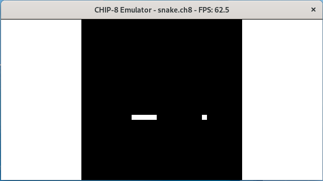

# CHIP-8 Emulator

This is a simple CHIP-8 emulator written in Python using pygame. CHIP-8 is a fantasy console created in the mid-1970s featuring:
- CPU: 8-bit CPU with 16 general purpose registers + 3 special registers;
- RAM: 4KiB;
- Screen: 64x32 monochromatic display with support for 8x15 sprites;
- Input: 16-button keypad
- Audio: Single tone only.

For more information check out: https://en.wikipedia.org/wiki/CHIP-8

# Using the emulator
Launch the emulator from a command line prompt:
    
    python main.py /path/to/rom.ch8

Requires Python 3.10 or newer and the pygame library (tested with pygame 2.1.2). 

# Controls

    CHIP-8 Input:       Keyboard Mapping:   Alternative:
    | 1 | 2 | 3 | C |   | 1 | 2 | 3 | 4 |   | - | ^ | - | - |
    | 4 | 5 | 6 | D |   | Q | W | E | R |   | < | - | > | - |
    | 7 | 8 | 9 | E |   | A | S | D | F |   | - | v | - | - |
    | A | 0 | B | F |   | Z | X | C | V |   | - | - | - | - |

    Where ^, <, > and v represent the arrow keys.

# Known issues
 - There's an audible "pop" whenever the audio tone stops playing. It seems that having another source playing audio mitigates this issue.
 - For whatever reason the framerate reported by pygame is always higher than 60 FPS. I haven't investigated to see if this is the expected behavior.

# Resources used during development
- pygame library: Used for keyboard input, video and audio output;
    - https://github.com/pygame/
- Cowgod's CHIP-8 Technical Reference: Used to implement most of the emulator;
    - http://devernay.free.fr/hacks/chip8/C8TECH10.HTM
- Guide to making a CHIP-8 emulator from Tobias V. Langhoff: Used as a complement to Cowgod's technical reference and for a clearer description of the draw instruction DXYN;
    - https://tobiasvl.github.io/blog/write-a-chip-8-emulator/
- Timendus' CHIP-8 Test Suite: Super helpful ROM to test the emulator. Used extensively during development;
    - https://github.com/Timendus/chip8-test-suite
- Timendus' Silicon8: A reference implementation of a CHIP-8 emulator. Used to better understand the 8XY6 and 8XYE instructions;
    - https://github.com/Timendus/silicon8
- Chip8-C from jameskozlowski: A CHIP-8 emulator with many useful features for debugging.
    - https://github.com/jameskozlowski/Chip8-C
- CHIP-8 Snake by steveRoll: Game featured in the screenshot.
    - https://steveroll.itch.io/chip-8-snake